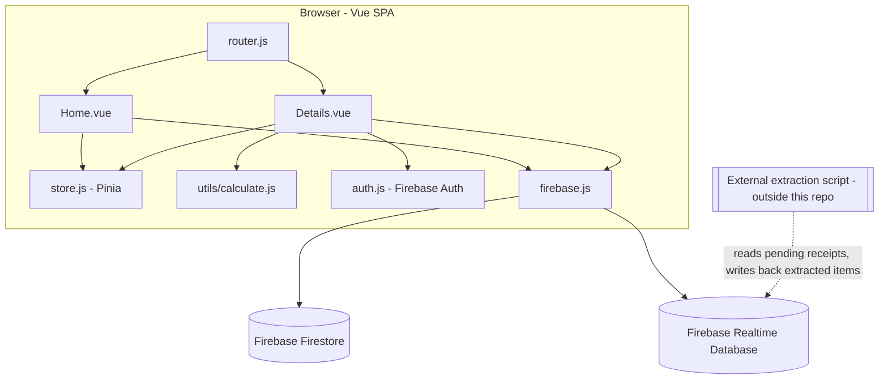
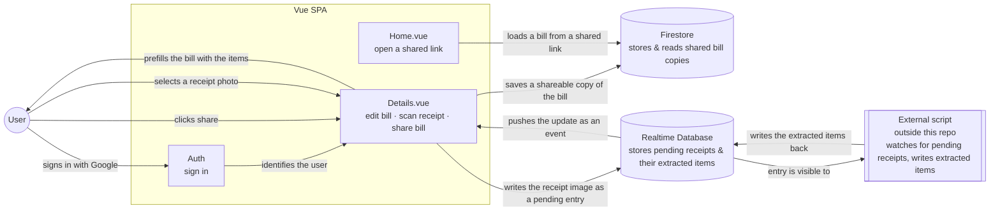

# Current Design — J1BP (Splitbills)

## Overview

J1BP is a Vue 3 single-page app for splitting a shared bill between people. It runs almost entirely client-side: a user enters people and food items, the app computes per-person shares and least-transaction settlements locally, and the result can be shared either as a self-contained encoded URL or via a Firestore document. A secondary feature lets a signed-in user photograph a receipt: the app writes the image straight into Firebase Realtime Database, and a script that runs **outside this repo** watches that database, extracts the line items, and writes them back to the same entry — the SPA is simply notified of that update via Firebase's SDK and prefills the bill.

**Stack**: Vue 3 (Composition API) + Vite + Vuetify 3 + Pinia + vue-router (memory history). Deployed to Vercel as a pure static site (no Vercel functions). Cloud persistence via Firebase Firestore (bill sharing) and Firebase Realtime Database (receipt scanning), with Firebase Authentication (Google OAuth) identifying the user for the receipt flow.

## Module / component diagram

## State ownership

Pinia (`store.js`) holds only bootstrap/config state set once when entering `Details.vue`: `iCountPersons`, `fGST`, `fSVC`, `data`, `iViewMode`, `fullpath`, `showSVCGST`. It is **not** where the live, editable bill lives. `Details.vue` seeds a local `arrPersons` ref from `store.data` (or builds defaults from `iCountPersons`) on mount, and all subsequent editing — names, food items, costs, per-item share checkboxes — happens on that local state. Derived values (item totals, pairwise payments, least-transaction settlement) are `computed()` from `arrPersons` via pure functions in `utils/calculate.js`, which has no Vue or store dependency and is unit-tested independently (`calculate.spec.js`).

## How the pieces interact

In plain terms: the SPA never talks to the extraction logic directly. It drops the receipt into Realtime Database and simply listens for that same record to change; whatever process fills in the answer — the external script — is decoupled from the app entirely, as long as it honors the entry shape below. The "scan receipt" control itself is only shown once signed in — there is no receipt feature at all while signed out. And since the external script might never respond, the SPA gives up and shows an error after a couple of minutes of waiting, rather than waiting forever.

### Realtime Database entry contract (`receipts/{uid}/{pushId}`)

The boundary the external script must honor is documented as a single source of truth in [`receipt-schema.md`](./receipt-schema.md) (field table + TypeScript type) — check both the SPA code and the external script against that file whenever either changes.

## Routes

| Path | View | Purpose |
|---|---|---|
| `/` | `Home.vue` | Entry point: setup form, or resolves `?data=`/`?share=` links into store state |
| `/details` | `Details.vue` | Main working view: edit bill, view totals/settlements, share, scan receipt |
